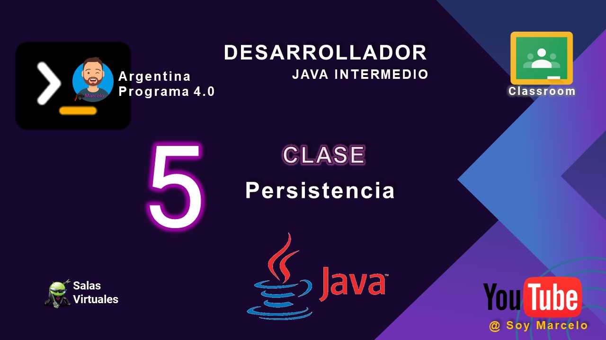

# clase_05
## Persistencia

## Proservices
Nos han contratado para diseñar y desarrollar un sistema para la búsqueda y contratación de
personas prestadoras de servicios profesionales, como gasistas matriculados, maquilladoras,
depiladoras, electricistas, instaladores de aire acondicionado, albañiles, entre varios otros.
El sistema debe:
1. Permitir que el administrador de la plataforma dé de alta nuevos servicios que podrán
ser prestados a los consumidores de servicio. El servicio está conformado por un conjunto
de tareas a realizar.
2. Permitir que los prestadores ofrezcan sus servicios a través de la plataforma. Se debe
solicitar al prestador que indique la disponibilidad de días y horarios de atención, radio de
cobertura, breve descripción de sus experiencias y fotos de trabajos realizados (si aplica).
3. Permitir que los prestadores modifiquen su perfil, el cual debe tener una foto, nombre
y apellido, fecha de nacimiento, tipo y número de documento, CUIT/CUIL y datos para el
contacto (teléfonos, emails).
4. Permitir que los consumidores de servicios contraten a un prestador para un
determinado trabajo, especificando claramente la fecha, lugar, rango horario en que se
deberá realizar el mismo y seleccionando aquellas tareas que se requieran hacer. Esto
último es importante para que el prestador defina un precio. Es indispensable que el
prestador acepte el contrato para que pueda realizar la tarea.
5. Permitir que los consumidores de servicios indiquen si el trabajo fue finalizado o no, de
igual manera que los prestadores.
6. Permitir que los consumidores de servicios puedan calificar a los prestadores por sus
trabajos realizados. Las calificaciones pueden ser de 1 a 5 estrellas, además de una opinión
libre.

7. Evitar que los prestadores con mala reputación sean contratados más de 1 vez por
semana y que los que tengan reputación regular sean contratados más de 4 veces por
semana. Los prestadores con buena reputación siempre pueden ser contratados. Para
mejorar la reputación, los prestadores deben recibir cuatro calificaciones seguidas de 4 o 5
estrellas.
8. Permitir que los consumidores de servicios elijan un criterio de búsqueda. Los criterios
pueden ser: radio de cercanía (se debe especificar los KMs a la redonda), días de atención,
horarios de atención. Todos los criterios siguen un algoritmo básico de búsqueda: 1) filtran
a los prestadores; 2) ordenan según la antigüedad y reputación en el sistema; 3)
seleccionan a los primeros N, siendo N un número elegido por el usuario.
Se pide
1. Armar el Modelo de Datos (DER) que brinde solución al dominio propuesto.

## Youtube

